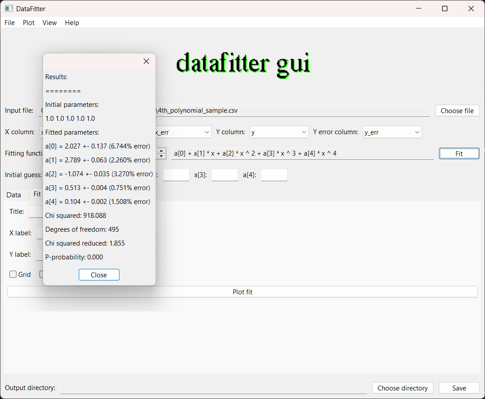
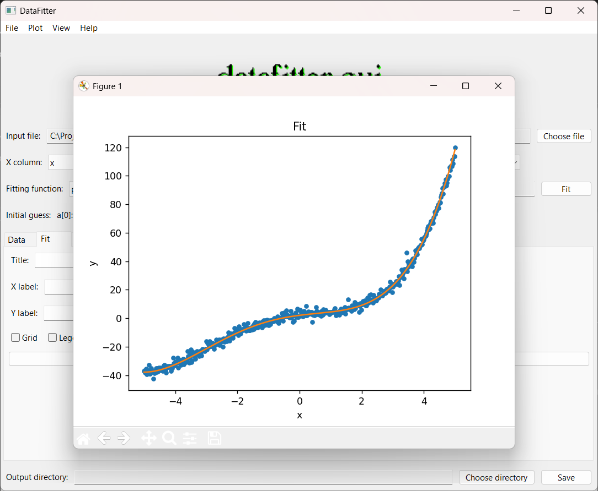

# DataFitter

A desktop GUI application for curve fitting and data visualization, built with Python. Load your data, select a fitting function, and get statistical results along with plots — all from a simple and clean interface.

---

## Features

- Supports CSV and XLSX data files
- 11 built-in fitting functions: constant, linear, polynomial (degrees 1–5), straight power, inverse power, hyperbolic, exponential, sin, cos, normal, and Poisson
- Real-time equation display for the selected fit
- Dynamic initial guess fields per fitting function
- Statistical results: fitted parameters with uncertainties, chi-squared, degrees of freedom, reduced chi-squared, and p-probability
- Separate plot tabs for Data, Fit, and Residuals — each with customizable title and axis labels
- Save all plots as PNG and fit statistics as a `.txt` file
- Adjustable font size (small, medium, large) via the View menu

---

## Installation

**Requirements:** Python 3.8+

1. Clone the repository:
```bash
git clone https://github.com/dn-stef/datafitter-gui.git
cd datafitter-gui
```

2. Install dependencies:
```bash
pip install -r requirements.txt
```

3. Run the application:
```bash
python main.py
```

---

## How to Use

### Loading Data
- Click **Choose file** or go to **File → Upload data file** to load a CSV or XLSX file
- The application assumes the first row contains column headers
- The four column dropdowns (X, X error, Y, Y error) are automatically assigned to the first four columns in order — you can change these manually if your file is arranged differently

### Fitting
- Select a fitting function from the **Fitting function** dropdown
- If you select **polynomial**, a degree selector appears (1–5)
- The equation for the selected function is displayed in the read-only field to the right
- Optionally fill in initial guesses for the parameters — leaving them blank defaults to 1.0
- Click **Fit** to run the fit and view the statistical results
- Sample datasets (polynomial, exponential, sine) are included in the `sample_data/` folder to try the application straight away.

### Plotting
- Use the **Data**, **Fit**, and **Residuals** tabs to configure and generate each plot
- Each tab has its own title, X label, and Y label fields — if left blank, they default to the column names and tab name
- Click the plot button in each tab to open the corresponding plot
- **Important:** the Fit and Residuals plots will only reflect the most recent fit. If you change the fit function or parameters, press **Fit** again before plotting

### Saving
- Click **Choose directory** at the bottom to set an output folder
- Click **Save** to export all three plots as PNG files and the fit statistics as `fit_stats.txt`
- Note: you must press **Fit** before saving — otherwise the stats file will be empty and the fit/residuals plots won't have any fit data in them

---
## Screenshots




---
## File Structure

```
datafitter-gui/
├── main.py               # Entry point
├── assets/               # Logo and other assets
├── gui/                  # All GUI components
│   ├── main_window.py    # Main panel and logic
│   ├── menu_bar.py       # Menu bar
│   ├── plot_panel.py     # Data/Fit/Residuals tab panels
│   └── fit_results.py    # Fit statistics popup window
├── fitting/              # Fitting engine
│   ├── functions.py      # All fitting function definitions
│   └── engine.py         # scipy curve_fit wrapper and statistics
├── data/
│   └── loader.py         # File reading and column extraction
├── output/
│   └── exporter.py       # Saving plots and statistics
└── requirements.txt
```

---

## Dependencies

- [wxPython](https://wxpython.org/) — GUI framework
- [NumPy](https://numpy.org/) — numerical operations
- [SciPy](https://scipy.org/) — curve fitting and statistics
- [Matplotlib](https://matplotlib.org/) — plotting
- [pandas](https://pandas.pydata.org/) — data loading
- [openpyxl](https://openpyxl.readthedocs.io/) — Excel file support

---

## Acknowledgements

Inspired by the open-source [EddingtonGUI](https://eddington-gui.readthedocs.io/en/latest/) project.

---

## About the Author 🃏

Physics graduate with a focus on data analysis and Python programming. Built DataFitter to expand my skills in GUI development while creating something practical and applicable to real scientific workflows. I enjoy combining physics-oriented thinking with programming to build tools that make data exploration more accessible.

---

## Acknowledgments 🤖

Inspired by [EddingtonGUI](https://eddington-gui.readthedocs.io/en/latest/).

---

Built with Python, wxPython, and matplotlib. 

<p align="center">
  
  
  
  
  
</p>
